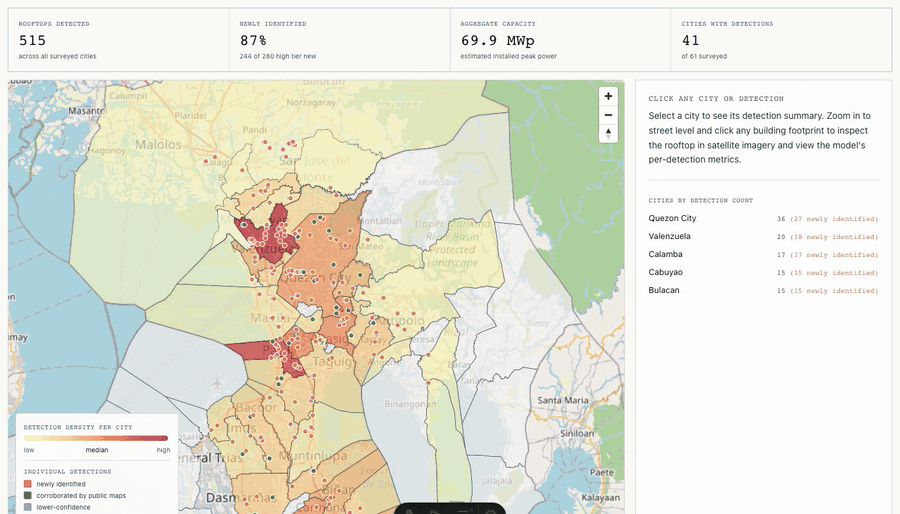

# SolarMap.PH

[](https://github.com/xmpuspus/solar-map-ph/actions/workflows/ci.yml)
[](LICENSE)
[](LICENSE)
[](https://www.python.org/downloads/)
[](#detection-pipeline-reproducible)
[](MODEL_CARD.md)

> SolarMap.PH: open-source rooftop solar detection from public satellite imagery. Current coverage: Greater Metro Manila. A frozen CLIP-ViT-L encoder plus a logistic-regression head, Platt-calibrated and bit-exact reproducible. F1 = 0.870 (precision 95.9%, recall 79.7%) at threshold 0.85 on an honest 20% held-out source-disjoint split.



<sub>Real recording of the `/map` page. (1) Survey of 515 rooftops across 41 cities (280 high-confidence, 235 below threshold, 87% of high-confidence detections absent from any prior public map of solar [footnote on methodology below], 69.9 MWp aggregate from the 384 buildings the per-roof segmenter localized). (2) Click into Quezon City and the sidebar surfaces 36 high-confidence detections, 27 newly identified, 15.6 MWp installed, plus thumbnails of the three largest installations the model found. (3) Zoom in further and click a single roof: per-building card returns kWp estimate, panel area, classifier confidence, OSM way id, and the link to confirm against the building footprint. The roof-lookup tool runs entirely in your browser; the address you type is sent to third-party geocoders directly (Photon, Nominatim, Overpass, Esri tiles, PVGIS) and never to a server we control.</sub>

## What's in this repo

- **`detection/`**: the CNN detection pipeline. Bootstraps positives from OpenStreetMap, embeds 600x600 px Esri tiles with CLIP-ViT-L, trains a logistic-regression head with 5-fold group-aware CV, calibrates with Platt sigmoid on an honest 20% holdout, and tiles 16,544 cells across NCR on a 240 m grid. Four rounds of active learning on high-confidence false positives. Outputs per-building polygons via a SAM auto-mask + color-signature filter + OSM building intersection.
- **`pipeline/`**: the Earth Engine quarterly batch. Pulls Sentinel-2 NIR/SWIR median, Landsat thermal, and VIIRS nightlights over a region polygon, z-scores per signal across cities, blends into a composite, and emits a per-city GeoJSON. Independent of `detection/`; the two pipelines answer different questions at different resolutions.
- **`site/`**: the Astro static site. Surfaces: a homeowner roof-lookup tool that runs in your browser (and reaches third-party geocoders directly), a city-level choropleth of detection density, a methodology page, an FAQ, and a privacy page.
- **`scripts/plot_pr_curve.py`**: regenerates PR + ROC + reliability diagrams from the calibration sweep. Run after every recalibration.
- **`scripts/check_no_residential_leaks.py`**: CI sanity check that no residential roofs leak into the published per-building dataset.
- **`scripts/verify_clf.py`**: hash-verify a classifier `.joblib` before running `joblib.load` on it. Use this on any classifier file received from a third party.
- **`tests/`**: pytest suite covering grid math, polygon helpers, quarter-to-date logic, and a classifier smoke test.

## What this is not

- Not engineering advice. The homeowner tool is informational. Consult a certified installer.
- Not address-level data. Polygons for buildings tagged `is_residential` are suppressed from the published per-building dataset; only commercial, industrial, and public-purpose roofs are released at sub-building resolution. The homeowner tool runs entirely in your browser; we run no server that logs the address you type.
- Not affiliated with Manila Electric Company. "Meralco" is referenced as the regulated distribution utility for the franchise area covered by this dataset.
- Not a permit registry, tax record, or code-compliance audit. SolarMap.PH publishes statistical indicators derived from public data. Patterns may have legitimate explanations.

## Privacy and responsible use

SolarMap.PH is a civic-tech research artifact. Inputs are publicly licensed (Esri World Imagery, OpenStreetMap, ESA, Microsoft, NOAA, NASA). Outputs are intended to inform public-interest reporting on the gap between informal rooftop solar and the formal net-metering registry.

The publication boundary:

- City-level aggregates: detection counts, density per km², kWp totals, composite scores. No individual identification.
- Per-building polygons for commercial, industrial, and public-purpose roofs only. Institutional subjects, not natural persons.
- Aggregated counts for residential rooftops: how many, by tag, summed kWp. No geometry, no addresses, no OSM way id.

Residential leaks are blocked at build time by [`scripts/check_no_residential_leaks.py`](scripts/check_no_residential_leaks.py). The build fails if any feature with `is_residential=true` or a residential `building=*` tag reaches `site/public/data/per_building_solar_ncr.geojson`.

Under RA 10173 (Data Privacy Act of 2012) §3(g), personal information is data that "directly and certainly" identifies a person, alone or "put together with other information." A satellite-derived rooftop polygon alone does not name anyone; the "put together with other information" exposure is the reason residential geometry is withheld entirely. The full posture is documented in [`docs/privacy-impact-assessment.md`](docs/privacy-impact-assessment.md).

- **DPO (self-designated):** Xavier Puspus, `xpuspus@gmail.com`. Formal NPC registration is in scope for the post-launch quarter.
- **Takedown channel:** Open a [GitHub issue with the `takedown` label](https://github.com/xmpuspus/solar-map-ph/issues/new?labels=takedown&template=takedown.md) (preferred, public audit trail) or email `xpuspus@gmail.com` with subject *Takedown request*. Acknowledged within 5 working days; feature removed within 14 working days at the next quarterly republish. For active doxxing concerns, use the [private security advisory](https://github.com/xmpuspus/solar-map-ph/security/advisories/new) form.

> All data sourced from public records (Esri World Imagery, OpenStreetMap, ESA, Microsoft, NOAA, NASA). SolarMap.PH computes statistical indicators only. Specific allegations, if any, require independent investigation and corroboration.

## Quickstart for researchers

The fastest path from `git clone` to a working classifier is under 5 minutes if you already have Python 3.11 and pip:

```bash
git clone https://github.com/xmpuspus/solar-map-ph
cd solar-map-ph

python3 -m venv .venv && source .venv/bin/activate
pip install -r requirements.txt

# Train clf_v4 from the committed dataset_v4.npz embeddings.
# Deterministic, no network, no GPU required. About 30 seconds on a laptop.
make train
make hash-verify        # asserts sha256 56900722a8427be4
make calibrate          # fits Platt + isotonic, writes calibration.json
make demo               # prints calibrated bundle summary
pytest tests/ -q        # 11 tests, ~1 second
```

To render PR / ROC / reliability figures:

```bash
pip install matplotlib
make plots              # writes to docs/figures/
```

To run the residential-leak sanity check against the published per-building GeoJSON:

```bash
python3 scripts/check_no_residential_leaks.py
```

## Quickstart for the site

```bash
cd site
pnpm install
pnpm dev                # http://localhost:4321
pnpm typecheck
pnpm build              # production build
```

## Detection pipeline (reproducible)

The CNN detection pipeline (CLIP-ViT-L embeddings + logistic regression + Platt calibration) ships with a Makefile, a Dockerfile, and pinned Python dependencies. The trained classifier is bit-exact reproducible from the committed `detection/train/dataset_v4.npz` embeddings (~11 MB, in git).

```bash
# Local
pip install -r requirements.txt
make train
make hash-verify        # asserts clf_v4.joblib sha256 prefix 56900722a8427be4

# Docker
docker build -t solar-map-ph:latest .
docker run --rm solar-map-ph:latest                     # default: make hash
docker run --rm solar-map-ph:latest make hash-verify    # asserts the prefix
docker run --rm -v $(pwd)/detection/scan/ncr_tiles:/app/detection/scan/ncr_tiles \
    solar-map-ph:latest make scan aggregate             # re-classify cached tiles
```

The image bundles `dataset_v4.npz` but not the raw NCR tile cache (~6.6 GB). Mount the cache as a volume for `make scan` and `make all`. See `Makefile` for every target.

Encoder is locked to `openai/clip-vit-large-patch14` after an ablation against `facebook/dinov2-large` (4 pt F1 lower) and `allenai/satlas-pretrain` (14 pt F1 lower). See `MODEL_CARD.md` for the full table.

Calibration is Platt sigmoid in production. Isotonic regression is run alongside and reported in `clf_v4_calibration.json` for comparison (isotonic has slightly lower Brier score; Platt wins on monotonicity and parameter count).

If someone sends you a classifier `.joblib` file, hash-verify it before invoking `joblib.load`. Pickle deserialization executes arbitrary code:

```bash
python3 scripts/verify_clf.py path/to/their_clf.joblib
```

## Earth Engine pipeline (quarterly)

Quarterly batch that emits a per-city composite signal. Independent from the detection pipeline and only needed for the city-scale `/map` choropleth.

```bash
cd pipeline
python3 -m venv .venv && source .venv/bin/activate
pip install -r requirements.txt

# Set EE credentials (see .env.example)
export EE_SERVICE_ACCOUNT="your-sa@your-project.iam.gserviceaccount.com"
export EE_KEY_FILE="/path/to/your-key.json"

python pipeline.py --quarter 2026Q2 --baseline 2022
python validate.py --quarter 2026Q2
```

Outputs land in `site/public/data/`:
- `solar_map_ph_2026Q2.geojson` (one feature per city)
- `solar_map_ph_barangay_2026Q2.geojson` (drilldown for built-up barangays)
- `solar_map_ph_summary_2026Q2.json` (franchise totals)

See `site/public/data/SCHEMA.md` for the field-by-field schema and units.

## Running on a different region

The pipeline is decoupled from Meralco / NCR. To run it on any other Philippine region (Cebu, Davao, Iloilo, Cagayan de Oro) or any geography worldwide, supply a region polygon GeoJSON. See [`examples/run_on_new_region.md`](examples/run_on_new_region.md).

## Headline numbers, with footnotes

- **515 rooftops detected across 41 cities** in Greater Metro Manila (NCR plus adjacent cities in Bulacan, Cavite, Rizal, Laguna), of which **280 are high-confidence** (model score >= 0.85) and 235 are below-threshold candidates included for review.
- **87% of the high-confidence detections (242 of 277)** were not already on a public map of solar at the time of the scan. "Public map" here means OpenStreetMap features tagged with `generator:source=solar` or similar within 200 m of the detected tile centroid; this is the same proximity threshold used in DeepSolar (Stanford, 2018) and SPECTRUM (ICSC, 2025). Of the 280 high-confidence detections, 277 land inside a city polygon and are counted; 3 fall on LGU borders.
- **69.9 MWp aggregate installed capacity** from the 384 buildings the SAM auto-mask successfully localized to an OSM building footprint. Capacity per building is computed as (segmented panel area in m²) / 6 m² per kWp, capped at the building footprint area.
- **27 residential rooftops** with detected solar are released as an aggregate count only (no geometry, no addresses). The breakdown by OSM `building=*` tag and the summed residential kWp are in [`site/public/data/residential_solar_aggregate.json`](site/public/data/residential_solar_aggregate.json).
- Calibrated **precision 96%, recall 80% at threshold 0.85** on an honest 20% held-out source-disjoint split. Expect roughly 1 in 25 high-confidence detections to be a false positive.

## Policy context

This dataset only matters because the policy context is contested. SolarMap.PH was designed around the gap between an estimated ~170 MW of formally net-metered rooftop solar in Meralco's franchise and the ~370 MW of estimated commercial rooftop solar outside the program, plus the residential "guerrilla solar" gap ICSC estimates at roughly one-third of the total franchise rooftop fleet. The full five-actor map (Meralco, DOE / Sen. Gatchalian, ERC, LGUs, households) is in [`docs/research/policy-context.md`](docs/research/policy-context.md). Related work and prior tooling in the same space (DeepSolar, PV_Pipeline, SPECTRUM, Global Solar Atlas, REMap) is in [`docs/research/related-work.md`](docs/research/related-work.md).

## Project layout

```
solar-map-ph/
|-- detection/
|   |-- bootstrap/          # OSM Overpass + Esri tile fetch
|   |-- buildings/          # Overpass building-lookup helper
|   |-- train/              # CLIP embedding + LogisticRegression head
|   |   `-- v4_calibrated/  # Honest 20% holdout + Platt + isotonic
|   |-- scan/               # 240m-grid classifier + SAM segmentation
|   |-- verify/             # Active-learning UI scaffolding
|   `-- README.md
|-- pipeline/               # Earth Engine quarterly batch
|   |-- pipeline.py
|   |-- validate.py
|   |-- scrape_meralco.py
|   |-- lgu_friction.json
|   |-- franchise_cities.json
|   |-- boundaries/
|   `-- requirements.txt
|-- site/                   # Astro static site, MapLibre + OSM
|   |-- public/data/        # Quarterly GeoJSON drops + per-building polygons
|   |   `-- SCHEMA.md       # Schema for every published file
|   |-- src/
|   |   |-- components/     # RoofLookup (roof tool), MapView, Header, Footer
|   |   `-- pages/          # index, map, methodology, safety, faq, privacy, post/
|   `-- vercel.json         # CSP, headers, redirects
|-- scripts/
|   |-- plot_pr_curve.py             # PR + ROC + reliability figures
|   |-- check_no_residential_leaks.py # CI gate on per-building dataset
|   `-- verify_clf.py                # Hash-verify a classifier joblib
|-- tests/                  # pytest suite (11 tests, no network)
|-- docs/
|   |-- figures/            # Regenerated by `make plots`
|   |-- screenshots/        # README hero
|   |-- privacy-impact-assessment.md # RA 10173 posture
|   `-- research/           # Source material for the writeup
|       |-- policy-context.md
|       `-- related-work.md
|-- examples/
|   `-- run_on_new_region.md
|-- MODEL_CARD.md           # Intended use, biases, ethics, citation
|-- CITATION.cff
|-- CHANGELOG.md
|-- CONTRIBUTING.md
|-- CODE_OF_CONDUCT.md
|-- SECURITY.md
|-- Makefile                # train / calibrate / scan / aggregate / hash-verify / plots
|-- Dockerfile              # Deterministic build, ships dataset_v4.npz
|-- requirements.txt        # Detection pipeline deps (== pinned)
|-- LICENSE                 # MIT (code) + CC-BY-4.0 (data)
`-- README.md
```

## Quarterly refresh cadence

About six hours of work per quarter. Annual LGU table refresh adds three hours once a year.

| Step | Time | Notes |
|---|---|---|
| 1. EE pipeline | 30m | `python pipeline.py --quarter YYYYQN --baseline 2022` |
| 2. Update Meralco aggregates | 30m | Refresh `meralco_aggregates.json` from public reports |
| 3. Validate | 30m | `python validate.py`, spot-check three cities visually |
| 4. Move data into site | 15m | Copy outputs to `site/public/data/`, bump `manifest.json` |
| 5. Residential-leak sanity check | 5m | `python scripts/check_no_residential_leaks.py` |
| 6. Write quarterly post | 1-3h | Optional. Skip if no story this quarter |
| 7. Methodology review | 15m | Add new caveats if surfaced |
| 8. Commit + deploy | 5m | `git push origin main`, Vercel auto-deploys. Tag release `solar-map-ph-YYYYQN` |
| 9. Distribution | 15m | Optional LinkedIn share, optional issue/PR routing. Skip HN/Reddit/X |

## Methodology in one paragraph

Every quarter, Earth Engine pulls Sentinel-2 NIR/SWIR median, Landsat 8/9 land surface temperature, and VIIRS DNB nightlights over the region polygon. Each signal is reduced to per-city statistics, z-scored across cities, and weighted (0.4 NIR, 0.3 SWIR, 0.2 LST, 0.1 nightlight) into a composite score. ESA WorldCover masks vegetation and water. Microsoft GlobalMLBuildingFootprints provides per-city building counts as a denominator. The composite score correlates with rooftop PV adoption but does not prove it; we are explicit that the signal is suggestive, not diagnostic, at city scale. See `/methodology` on the site for the full algorithm and caveats.

## Data attribution

SolarMap.PH inputs come from publicly licensed third parties. Cite the upstream sources when reusing derivatives:

- **Esri World Imagery**: training imagery and homeowner-tool satellite tiles, via the publicly documented `World_Imagery` REST endpoint. Attribution: *Esri, Maxar, Earthstar Geographics, and the GIS User Community*. Esri's posture on this layer is broadly permissive for academic and non-commercial use with attribution; Esri publishes its own pretrained solar-detection models on the same imagery base.
- **OpenStreetMap** (ODbL): building footprints and `building=*` tags. Attribution: *© OpenStreetMap contributors*.
- **ESA WorldCover v200** (CC-BY-4.0): land cover masking for vegetation and water exclusion.
- **Microsoft GlobalMLBuildingFootprints** (ODbL-equivalent): per-city building-count denominators.
- **Sentinel-2** (ESA Copernicus, public domain): NIR/SWIR median.
- **Landsat 8/9** (NASA/USGS, public domain): land surface temperature.
- **VIIRS Day/Night Band** (NOAA, public domain): nightlight component.
- **Segment Anything Model** (Meta, Apache 2.0): rooftop panel segmentation.
- **CLIP-ViT-L** (OpenAI, MIT): image encoder.
- **Photon / Komoot**, **Nominatim / OpenStreetMap**, **Overpass API**: geocoding and building-tag lookup in the homeowner tool.
- **PVGIS** (European Commission JRC): solar irradiance for the payback calculator.

## License

Code: MIT. Data products in `site/public/data/`: CC-BY-4.0. Cite as `SolarMap.PH (YYYY-QN), https://github.com/xmpuspus/solar-map-ph`. See `CITATION.cff` for the canonical citation, `MODEL_CARD.md` for intended use and biases, and `SECURITY.md` for the threat model.

Author: Xavier Puspus.

## Contributing

Highest-value contributions, in priority order:

1. Verified false-positive reports on detections in the published per-building dataset.
2. LGU permit cost and delay data for cities not in `pipeline/lgu_friction.json`.
3. Region extensions to another Philippine geography outside the Meralco franchise (e.g., Cebu, Davao, Iloilo, Cagayan de Oro).
4. Encoder ablation submissions against Prithvi, SkySense, SatMAE, CLIPSeg.
5. Code review and bug fixes.

See `CONTRIBUTING.md` for the full dev setup and PR conventions, and `.github/ISSUE_TEMPLATE/` for issue templates.

## References

- DeepSolar (Stanford), Joule 2018: https://www.sciencedirect.com/science/article/pii/S2542435118305701
- SPECTRUM (ICSC, 2025): https://icsc.ngo/solar-mapper/
- ESA WorldCover v200: https://esa-worldcover.org
- PVGIS, European Commission JRC: https://re.jrc.ec.europa.eu/pvg_tools/en/
- Segment Anything (Meta, 2023): https://segment-anything.com
- CLIP (OpenAI, 2021): https://openai.com/research/clip
- Full bibliography: [`docs/research/related-work.md`](docs/research/related-work.md)
